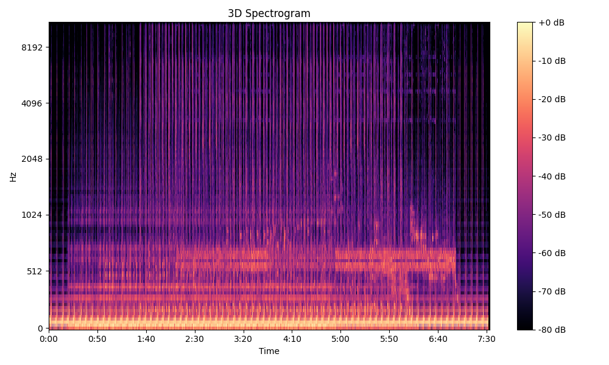
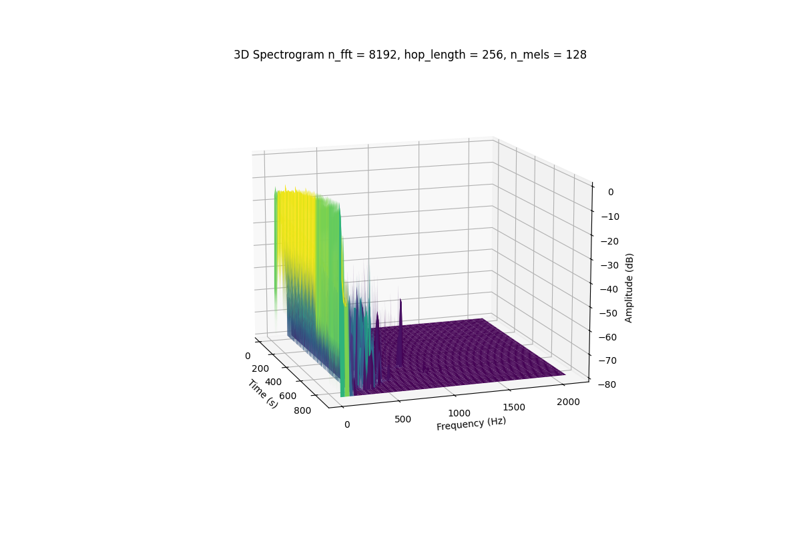
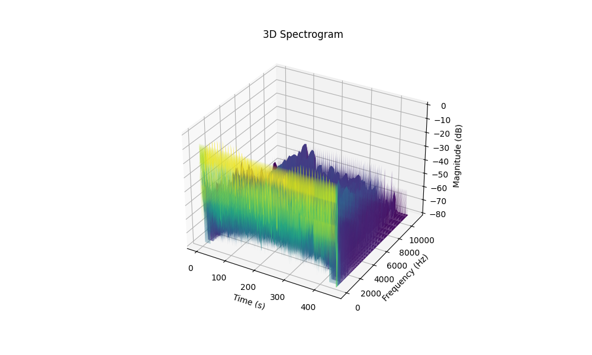
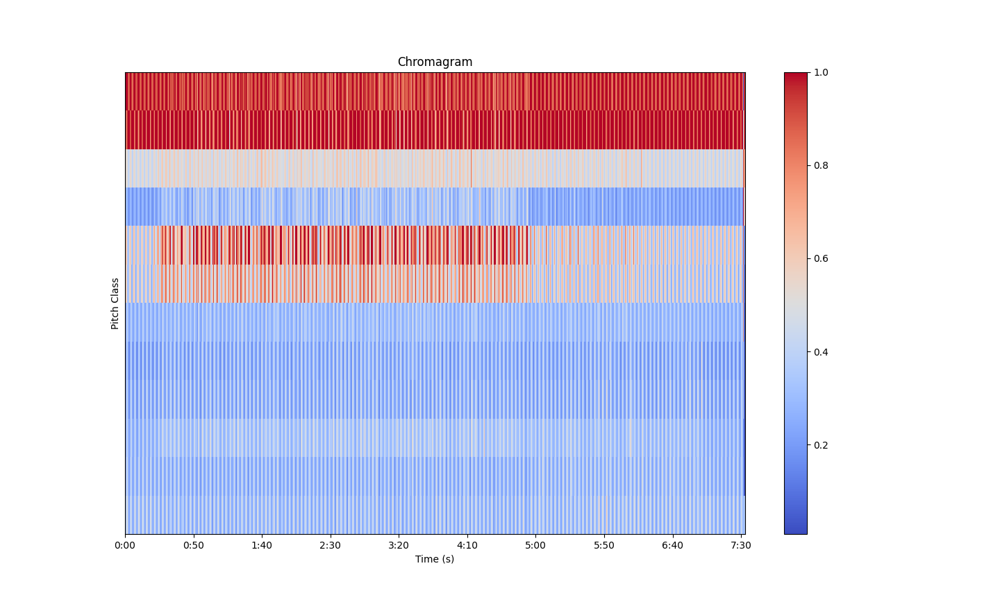
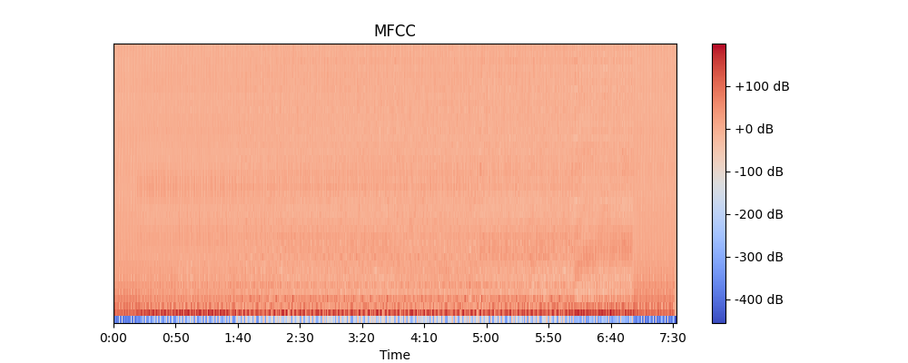
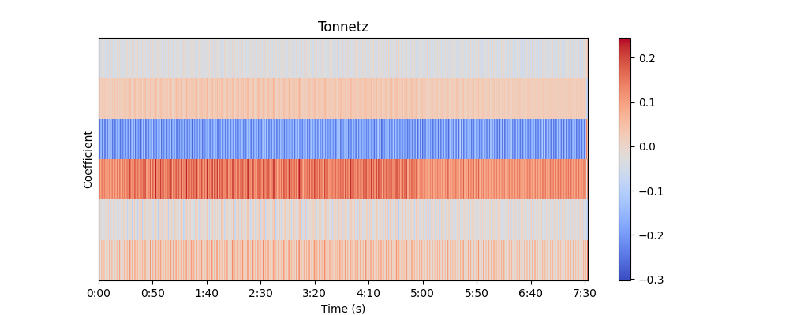

# Signal Processing with Python

## Overview

This project focuses on signal processing using Python, particularly analyzing the audio track "b1. stranno neobjatno" by Nina Kraviz. Various signal processing characteristics have been explored, and visualizations have been generated to better understand the underlying sound properties.

## Table of Contents

- [Installation](#installation)
- [Libraries Used](#libraries-used)
- [Theoretical Background](#theoretical-background)
  - [Sound Processing](#sound-processing)
  - [Signals](#signals)
  - [Frequency Analysis](#frequency-analysis)
  - [FFT (Fast Fourier Transform)](#fft-fast-fourier-transform)
  - [Spectrogram](#spectrogram)
  - [Harmonic and Percussive Components](#harmonic-and-percussive-components)
- [Graphs](#graphs)
- [PyQT5 Visualization](#pyqt5-visualization)

## Libraries Used

The project utilizes the following Python libraries:

- NumPy
- Matplotlib
- Librosa
- PyQt5
- Pyqtgraph

Make sure to install these libraries before running the scripts.

## Theoretical Background

### Sound Processing

Sound processing involves the manipulation, analysis, and synthesis of audio signals. It plays a crucial role in various applications such as speech recognition, music production, and telecommunications.

### Signals

In the context of audio processing, signals represent variations in air pressure over time. These variations are captured and processed to extract meaningful information from sound.

### Frequency Analysis

Frequency analysis is essential for understanding the distribution of frequencies within an audio signal. It aids in identifying key features, such as pitch and timbre.

### FFT (Fast Fourier Transform)

The Fast Fourier Transform is an algorithm used to efficiently compute the discrete Fourier transform, providing insights into the frequency components of a signal.

### Spectrogram

A spectrogram is a visual representation of the spectrum of frequencies in a signal as they vary with time. It's a valuable tool for identifying patterns and trends in audio signals.

### Harmonic and Percussive Components

Harmonic components represent pitched elements, while percussive components capture non-pitched, rhythmic elements. Distinguishing between these components provides insights into the structure of the audio.

## PyQT5 Visualization

A subpart of this project involves a PyQt5 visualization using pyqtgraph. The `step_func_3d_visualization.py` script creates an interactive 3D plot with evolving step functions. This visualization provides a dynamic representation of the audio signal's characteristics.

## Graphs

- **2D_spectrogram**

 A two-dimensional representation of the frequency content of the audio signal over time.
- **3D_spectrogram_nfft**

 A three-dimensional representation of the spectrogram with emphasis on the Fast Fourier Transform (FFT).
- **3d_spectrogram** A three-dimensional visualization of the frequency content of the audio signal.

- **Chromagram** 

A representation of the pitch content of the audio signal.
- **MFCC Delta Coefficient** 

Mel-frequency cepstral coefficients (MFCC) delta coefficient visualization.
- **MFCC** 

Visualization of Mel-frequency cepstral coefficients, providing information about the audio's spectral characteristics.
- **Power Spectrum** 

Displaying the distribution of power in the frequency spectrum.
- **Tonnetz** 

Visualization of tonnetz features, capturing harmonic relationships in the audio signal.
- **Waveform with Beats**

 Audio waveform with beats highlighted, showcasing rhythmic components.
- **Waveform**

 Standard representation of the audio signal waveform.

